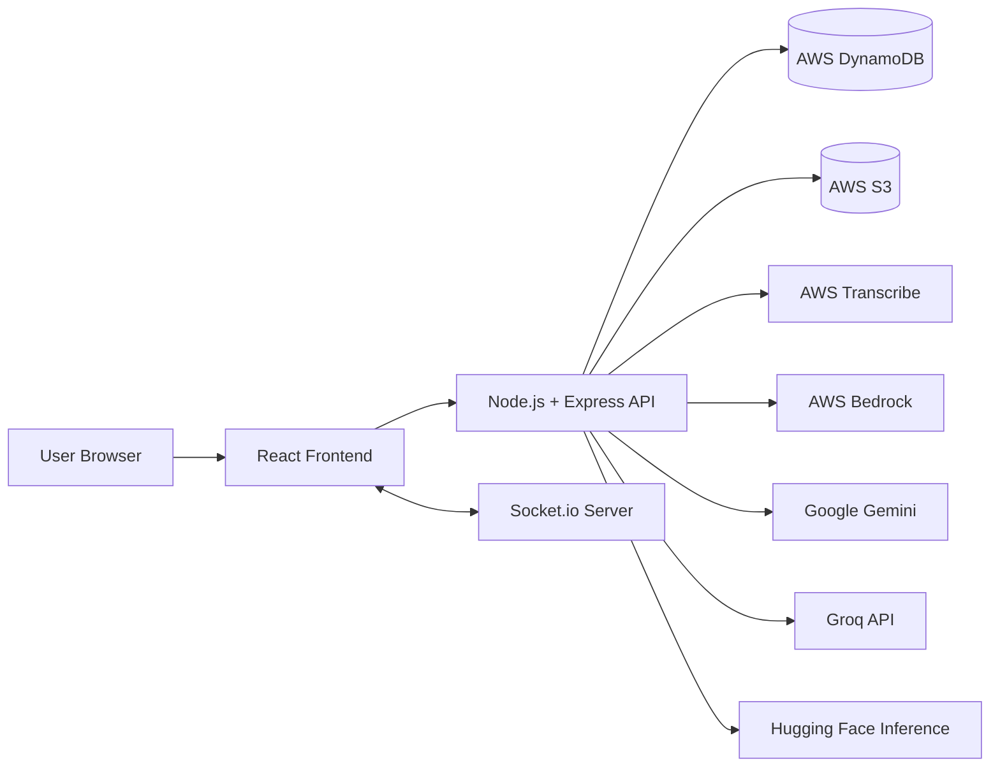

# Placify: Architecture And System Flow

## 1. High-Level Architecture
Placify follows a client-server architecture with real-time messaging and cloud-integrated AI processing.

## 2. Runtime Components

### 2.1 Frontend Layer
- React application with React Router and Tailwind UI.
- Socket client for online user state and typing events.
- API communication to backend using REST endpoints.

### 2.2 Backend Layer
- Express app exposing domain routes:
  - auth, users, posts, messages,
  - resume and ATS analysis,
  - chatbot,
  - InterviewIQ deck/response/evaluation lifecycle.
- Middleware handles:
  - CORS validation,
  - JSON/form parsing,
  - authentication and error handling.
- Socket.io server handles:
  - JWT socket auth,
  - presence updates,
  - typing/stopTyping events.

### 2.3 Data Layer
- AWS DynamoDB tables for:
  - users, posts, comments,
  - resumes,
  - messages and conversations,
  - InterviewIQ questions/decks/responses/progress.

### 2.4 Cloud/AI Services
- AWS S3 for file and interview recording storage.
- AWS Transcribe for speech-to-text conversion.
- AWS Bedrock for InterviewIQ scoring pipelines.
- Google Gemini and Groq for ATS/chatbot intelligence.
- Hugging Face model inference for anti-cheat/object/person detection.

## 3. Core System Flows

## 3.1 Authentication Flow
1. User submits login/register request.
2. Backend validates and returns JWT.
3. Frontend stores token and initializes protected views.
4. Socket connection authenticates using token in handshake.

## 3.2 Resume ATS Analysis Flow
1. User uploads resume content/file.
2. Backend parses document and prepares analysis prompt/context.
3. AI provider (Gemini/Groq) returns structured insight.
4. Backend returns ATS signals to frontend for rendering.

## 3.3 Real-Time Chat Flow
1. User A sends message to user B via REST endpoint.
2. Message is persisted in DynamoDB.
3. Backend emits real-time message event to recipient socket if online.
4. Typing and read-state events propagate through socket channels.

## 3.4 InterviewIQ Evaluation Flow
1. User starts deck and uploads recorded answer.
2. Backend stores raw recording in S3.
3. Transcribe converts speech to transcript.
4. Evaluation service computes multi-model score:
   - transcript + LLM quality scoring,
   - anti-cheat video signal,
   - keyword heuristic score.
5. Aggregated results are persisted and exposed through polling/result routes.

## 4. Reliability And Safety Patterns
- CORS allow-list plus pattern validation for localhost and Vercel domains.
- Route-level auth protection with JWT middleware.
- Structured repository pattern for DynamoDB operations.
- Error middleware for consistent API error response.
- InterviewIQ fallback strategy for model availability.

## 5. Deployment Topology
Recommended topology used in project docs:
- frontend hosted on Vercel,
- backend hosted on Vercel serverless/Node runtime,
- data and AI workloads on AWS services.

This split keeps UI delivery fast while preserving cloud-native backend capability.

## 6. Architectural Strengths
- clear modular separation (routes, controllers, repositories, services),
- polyglot AI integration with fallback-capable design,
- scalable NoSQL data model using DynamoDB,
- event-driven real-time layer via Socket.io,
- interview workflow designed for asynchronous evaluation.
